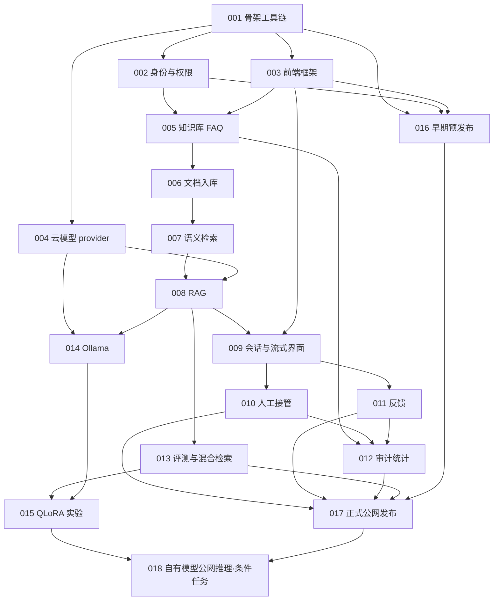

# 智能客服与知识库系统实施计划

> **面向执行者：**逐任务执行时使用 `superpowers:subagent-driven-development` 或 `superpowers:executing-plans`。每个独立对话只领取一个 `todo-ID`，先读本计划、[架构](ARCHITECTURE.md)、[接口契约](CONTRACTS.md)、[协作流程](WORKFLOW.md)及该任务文档，再进入独立 worktree。下列复选框表示未来工作，不表示已经执行。

**目标：**从空目录建设可在公网部署的中文智能客服系统，支持多知识库、带引用的问答、人工接管、反馈与统计，并为本地模型和后期微调保留明确实验路径。

**架构：**采用模块化单体、前后端分离开发、同源部署。PostgreSQL 保存业务数据与向量，后台入库任务独立进程运行；模型统一经过 provider 适配。知识权限、会话权限和模型输出边界都在服务端执行。

**技术栈：**Node 24 LTS、Vue 3、TypeScript、Vite、Element Plus、ECharts；Python 3.12、FastAPI、SQLAlchemy 2、Alembic、uv；PostgreSQL 16、pgvector；SentenceTransformers `BAAI/bge-small-zh-v1.5`；Linux、Docker Compose、Caddy。云模型 API 为基础路线，Ollama 为本地切换路线；4B QLoRA 在后期使用 WSL2 与 LLaMAFactory 实验。

**规格依据：**[架构](ARCHITECTURE.md)与[接口契约](CONTRACTS.md)是任务实现依据；发生冲突先修订契约并记录影响，再修改代码。没有现有应用代码，所有应用路径和命令均为规划目标。

## 全局约束

- 系统是单一组织使用的多知识库应用，不建设 SaaS 多租户、计费或组织隔离体系。
- 角色固定为 `user`、`agent`、`admin`；会话只允许本人、已接单客服或管理员访问。客服排队列表只返回接单所需的最少信息。
- 知识库权限限制同时作用于检索、文档元数据、下载与回答引用；禁止仅靠前端隐藏控件保护资源。
- 认证使用 `HttpOnly` Cookie，状态变更请求具有 CSRF 校验；认证凭据不写入 `localStorage`，默认不启用跨源部署。
- 文档范围为可提取文本的 PDF、DOCX、TXT、MD；扫描件 OCR、复杂表格/图片理解不属于基础交付。不可提取内容必须明确失败或提示，不能伪造成功。
- 入库、引用、流式事件、错误码、迁移与配置遵循 [CONTRACTS](CONTRACTS.md)，不得在不同任务中各自发明协议。
- 每个任务先编写有意义的行为测试并确认预期失败，再实现最小功能；文档与实验记录修改只做结构、内容和复现检查，不为文档捏造单元测试。
- `done` 只用于已合入权威 `main` 且检查通过的任务。任务分支最终状态为 `in_review`；合并后通过统一收尾提交或 PR 更新为 `done`，不用包含自己提交 SHA 的自引用记录。
- 当前阶段仅规划：不安装依赖、不开发应用、不启动服务、不声称任何测试已通过；允许为规划文档建立本地 main 基线提交。
- 文档解析与索引分开交接：006 解析候选版本到 `parsed`、创建 index 任务但不切换有效版本；007 索引全部成功后原子切换 `active_revision_id` 并设 `ready`，期间旧有效版本继续服务。

## 重点评审条件

1. 猜测资源 ID、把别人的知识库 ID 填入请求：应拒绝访问且检索不返回受限片段；由 002、005、007、009、010 验证。
2. 上传扫描 PDF、重复文件、进程中断或解析器异常：状态可理解、可安全重试、无重复有效版本；由 006 验证。
3. 云模型超时、SSE 中途断流、浏览器重复提交：不得把残缺回答记成完整成功，不能重复产生用户消息；由 004、008、009 验证。
4. 两名客服同时接单、人工接管与模型流同时发生：只允许一名客服获得接管权，交接后 AI 不再写最终回答；由 010 验证。
5. 资料过期、检索为空、文档中的恶意提示及权限撤销：应拒答或告知不确定，引用仍可追溯且不能借模型绕过权限；由 007、008、013 验证。

## 阶段与完成边界

| 阶段 | 任务 | 可验收交付物 | 完成条件 |
|---|---|---|---|
| A 基础与风险前置 | 001、002、003、004、016 | 可复现工具链、登录与角色外壳、云模型适配、早期预发布站点 | 新 worktree 可启动；预发布 HTTPS、迁移与健康检查跑通 |
| B 知识与回答 | 005、006、007、008、009 | 多知识库、可靠入库、检索、引用拒答、流式会话页面 | 权限贯穿上传到引用；核心端到端问答通过 |
| C 客服闭环 | 010、011、012 | 人工接管、反馈处理、审计与管理统计 | 接单竞争正确；反馈可闭环；统计可核对 |
| D 质量与可替换模型 | 013、014 | 固定评测集、检索对照、Ollama 适配 | 评测报告可复现；provider 可切换并保持事件协议 |
| E 基础公网交付 | 017 | 正式站点、完整外网验收、备份恢复与回滚演练记录 | 010、011、012、013、016 全部已合入且正式检查通过；真实云 provider 已验证 |
| F 后期增强 | 015，按需 018 | 4B QLoRA 对照实验；用户选择后将自有模型上线 | 015 有真实实验报告；仅用户明确选择自有模型公网推理时要求 018 |

基础公网发布不等待 014 的本机环境或 015；014 仍是本项目本地模型增强目标。“全部增强目标完成”需完成 014、015，并根据线上模型选择判断 018 是否启用。015 不保证微调一定优于基座，负结果也是有效实验结论；018 保持 `planned_optional`，直到用户决定启用。

## 依赖图



箭头表示开始任务前的代码和契约依赖。实现与评审可以并行，依赖必须先合入权威 `main` 才视为满足；不得靠拷贝其他未合入 worktree 目录假装依赖就绪。

## 可安全并行的开发批次

| 批次 | 可同时领取 | 边界与限制 |
|---|---|---|
| 1 | 001 | 先固定工具链和基础约定；其他任务只可预读规划 |
| 2 | 002、003、004 | auth、前端壳、provider 三个主要目录独立；003 用契约 mock，002/004 的依赖增补与路由注册由单人整合 |
| 3 | 005、016 | 前者编辑业务模块，后者编辑部署；部署需要的应用改动先协调，不能复制一套后端配置 |
| 4 | 006 | 005 合入后建立入库状态与版本模型；同时可完成 016 的外部配置 |
| 5 | 007 | 等待 006 合入；避免向量 schema 与入库重建互相覆盖 |
| 6 | 008 | 007、004 合入后实现唯一 RAG 编排入口 |
| 7 | 009、013、014 | 会话、评测、Ollama 可并行；013 对检索共用文件的改动独占，014 只在 provider 适配边界扩展 |
| 8 | 010、011、015 | 009 已合入后做接管和反馈；015 额外等待 013、014。010/011 的共享会话 schema 不得同时无协调修改 |
| 9 | 012，继续 015 | 010/011 合入后建立统计闭环；实验可独立持续 |
| 10 | 017，继续 014/015 | 017 依赖云模型基础版全部上线门槛；本地推理与训练环境不阻塞基础发布 |
| 11 | 018 | 015、017 完成且用户明确启用后执行 |

批次不是强制日程；例如 016 可以在 002、003 合入后立即前置。一个人可顺序完成，多个独立对话按目录边界领取。每个任务的领取、更新、暂停与合并规则见 [WORKFLOW](WORKFLOW.md)。

## 文件归属与冲突控制

| 路径/资源 | 首建任务 | 后续规则 |
|---|---|---|
| `backend/pyproject.toml`、`backend/uv.lock` | 001 | 一个批次一个依赖整合者；功能任务说明所需依赖，由整合者更新并验证冻结安装，不手工编辑 lock |
| `frontend/package.json`、`frontend/package-lock.json` | 001 | 同上；003/005/009 增补依赖先协调；安装命令只在实际开发阶段执行 |
| `backend/migrations/versions/` | 001 建框架 | 每个业务任务拥有自己迁移；生成前基于最新 main，评审时检查单一 head。分叉时明确合并迁移或重排未发布迁移，不能删除已应用迁移 |
| `backend/app/main.py`、路由注册、统一模型导入 | 001 | 各模块输出独立 router；共享注册文件指定一个整合者串行改动，并核对 OpenAPI 路径无覆盖 |
| `frontend/src/router/index.ts`、导航与公共类型 | 003 | 各 feature 提供路由/页面，聚合改动串行；后续以契约生成/复用类型，避免复制漂移 |
| `backend/app/modules/retrieval/` | 007 | 013 是后续唯一算法变更任务；008 只调用约定检索入口，不另建检索器 |
| `backend/app/modules/chat/` | 009 | 010/011 需要共用字段时先提交小契约变更，再各做模块逻辑；不能同时修改同一状态机 |
| `infra/`、部署环境与服务器 | 001/016 | 016 拥有预发布配置，017 在同一配置基础上加正式环境；禁止两个对话同时部署同一环境 |
| 文档状态与根索引 | 各任务 | 任务分支只更新自己的任务工作记录；根 `todo.md` 与合并后状态由约定整合者更新 |

每个 worktree 使用唯一 Compose 项目名、数据库名/连接配置、端口和上传路径；不可复用他人的可写数据目录。迁移只对本任务隔离数据库或获得明确授权的目标环境执行。

## 功能覆盖与逐项交付物

| 任务 | 交付物 | 覆盖的用户能力 |
|---|---|---|
| [001](tasks/todo-001.md) | 工程骨架、审计基础、锁文件、检查脚本、CI、本地数据库 Compose | 新环境可按文档复现开发 |
| [002](tasks/todo-002.md) | Cookie 登录会话、CSRF、RBAC、资源权限函数、用户管理 API、管理员引导 | 安全登录、用户角色和资源权限 |
| [003](tasks/todo-003.md) | 应用布局、路由、角色导航、统一 API 状态、用户管理页面 | 用户/客服/管理员界面入口 |
| [004](tasks/todo-004.md) | 云模型流式适配、统一事件、取消与超时 | 接入云模型且替换实现不影响业务 |
| [005](tasks/todo-005.md) | 知识库/FAQ CRUD、授权、后台页面、迁移 | 多知识库与 FAQ 维护 |
| [006](tasks/todo-006.md) | 文件上传、解析切分、任务持久化、版本、状态 UI | 文本资料可靠入库与失败重试 |
| [007](tasks/todo-007.md) | 本地 embedding、pgvector 检索、权限过滤 | 找到有权访问的相关知识 |
| [008](tasks/todo-008.md) | 多轮查询改写、意图、证据提示词、引用与拒答 | 有依据且可解释的知识问答 |
| [009](tasks/todo-009.md) | 会话消息、SSE 页面、历史、引用来源 | 连续对话、流式回答和历史回看 |
| [010](tasks/todo-010.md) | 转人工、排队、原子接单、客服回复/关闭 | AI 与人工客服顺畅交接 |
| [011](tasks/todo-011.md) | 评价、纠错原因、客服处理与状态 | 用户反馈与处理闭环 |
| [012](tasks/todo-012.md) | 脱敏日志、审计事件、统计 API 和 ECharts | 管理员追踪操作与查看业务数据 |
| [013](tasks/todo-013.md) | 标注评测集、基线报告、混合检索与重排对照 | 用指标判断问答质量和检索改进 |
| [014](tasks/todo-014.md) | Ollama provider、配置与本机推理报告 | 在相同业务流程中切换本地模型 |
| [015](tasks/todo-015.md) | 训练数据、WSL2 环境说明、QLoRA 配置、对照报告 | 用本机 16GB 显存进行 4B 微调实验 |
| [016](tasks/todo-016.md) | 镜像、同源反代、HTTPS、预发布脚本与记录 | 提早验证公网环境与基础部署 |
| [017](tasks/todo-017.md) | 正式配置、外网 E2E、恢复与回滚报告、运维手册 | 完整功能在真实公网可用 |
| [018](tasks/todo-018.md) | 自有模型推理制品、公网服务验证与回退 | 用户选择后上线自有微调模型 |

## 统一验证入口

以下命令由 001 建立，当前尚不存在可执行应用。工作目录和参数必须按每个 worktree 的实际位置配置。

```powershell
# 在工作树根目录；替换为该工作树唯一项目名，不照抄尖括号
docker compose -f infra/compose.dev.yaml -p <唯一worktree项目名> up -d db

# 在 backend 目录
uv sync --frozen --extra dev
uv run pytest
uv run ruff check .

# 在 frontend 目录
npm ci
npm run lint
npm run typecheck
npm run test -- --run
npm run build
npm run test:e2e
```

测试分层：纯算法/权限测试使用固定样本；数据库与迁移测试使用隔离 PostgreSQL；模型适配测试使用可控制的假服务；真实云模型、本地 GPU 与公网测试单独标注外部条件与成本。CI 默认不需要真实模型密钥。修复后执行任务相关测试和受影响共享检查，合并前执行 CI 定义的完整检查；不重复无关耗时训练。

## 外部输入与等待条件

| 任务 | 必要外部输入 | 缺失时可继续的工作 |
|---|---|---|
| 004/008/017 | 云模型提供商、模型 ID、API 地址/密钥及使用预算 | 004/008 可凭完整假服务/契约测试交付实现；真实云 API smoke 可提前执行，但最晚在 017 正式发布前完成，不能用 Mock 冒充公网模型能力 |
| 005/006/013 | 有权使用的知识资料、访问规则、代表性问题和人工参考答案 | 用明确标注的合成样例开发；发布前补真实验收集 |
| 014 | 本机可用 Ollama、确定的模型名称/版本、模型下载许可 | 完成协议适配和错误路径测试；真实性能记录等待环境就绪 |
| 015 | 可用于训练的数据与许可、基座模型许可、WSL2/GPU 驱动环境、实验预算 | 完成数据校验与实验配置；不把未运行配置写成训练成功 |
| 016/017 | Linux 服务器访问授权、域名/DNS 控制、备案/网络条件（适用时）、持久化位置和密钥 | 构建镜像、检查 Compose、编写脚本；部署验证不能提前勾选 |
| 018 | 用户明确选择自有模型上线、推理 GPU/服务资源与成本、可发布模型制品 | 保持 `planned_optional`，不提前采购或部署 |

在任务中用 `blocked` 记录实际阻塞原因、已完成内容和解除条件。单个外部验证未完成但实现仍可推进时，继续独立工作；任务不能在必需验收尚缺失时标为 `done`。

## 执行与收尾

- [ ] 用户审阅规格与任务拆分，未来对话按 `todo-ID` 领取。
- [ ] 执行者先核对依赖的合入状态、工作树隔离与外部输入。
- [ ] 按任务内测试、最小实现、验证、评审步骤交付一个可独立评审的变更。
- [ ] 在任务工作记录写入真实命令、结果、限制、分支和提交；只有实际生成后才能记录这些标识。
- [ ] 任务分支到 `in_review`，完成评审和合并。
- [ ] 整合者依据合入的 commit/PR 与 CI 结果，另做收尾记录将任务置为 `done`；下一批从权威 main 开始。

详细状态机、领取模板及完成证据格式以 [WORKFLOW](WORKFLOW.md) 为准。
